## Hi there! 👋

I'm **ngnsusinn** - a passionate **Backend Developer** with a strong foundation in algorithms and system design.

- 🎓 Currently studying **Information Technology** at **[Ho Chi Minh City University of Transport](https://ut.edu.vn/)**
- 💻 Specializing in **Backend Development** and **API Design**
- 🔭 Interested in competitive programming, algorithms, and database optimization
- 💬 Open to discussing backend architectures, system design, and problem-solving!
- ⚡ Fun fact: I sharpen my algorithmic skills on Codeforces and LeetCode

---

#�📊 Github stats

## 📈 Coding profiles stats

## 🛠️ Tech Stack

### Backend & Languages

### Databases

### Tools & Platforms

### Others

